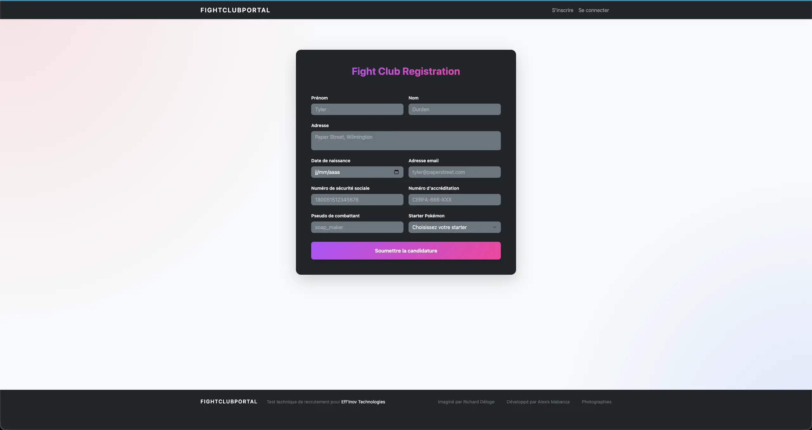
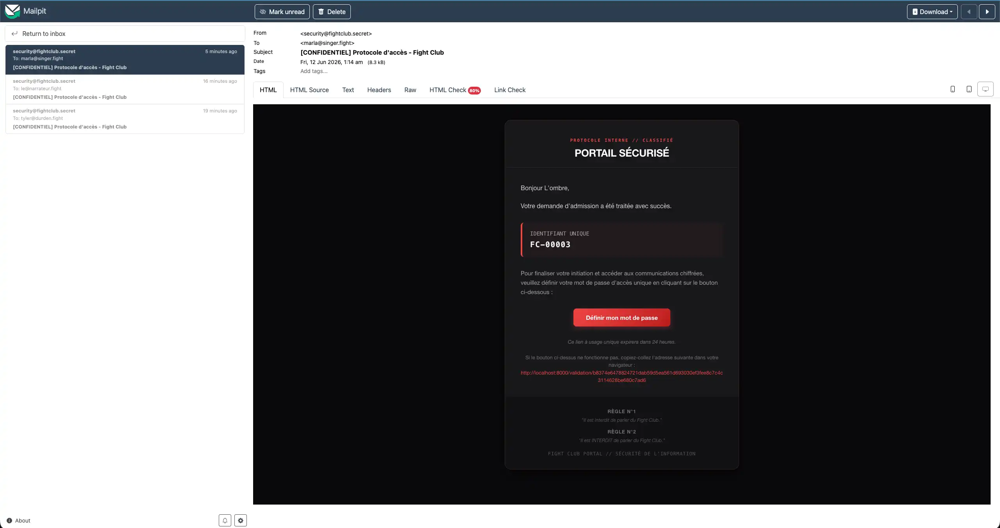
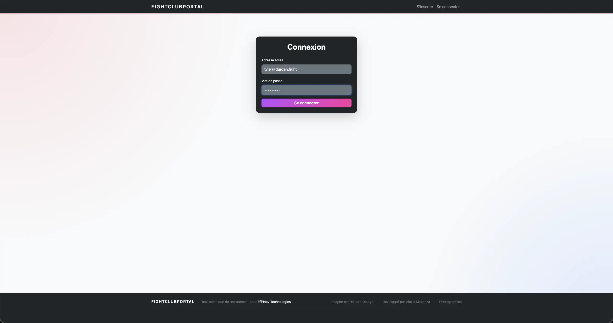
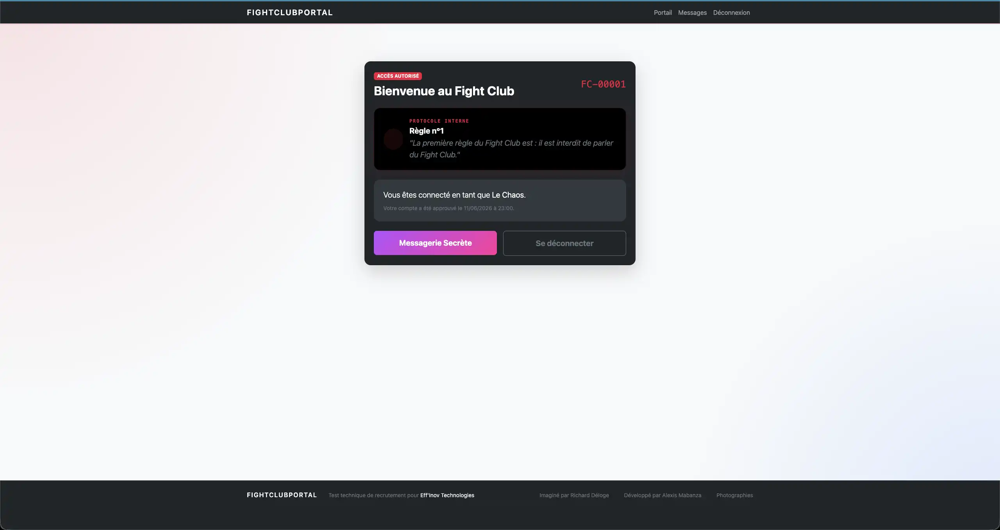
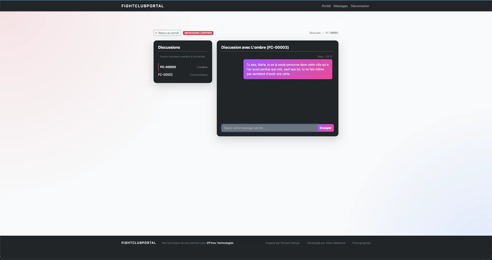

# FightClubPortal - Messagerie Chiffrée et Portail Membres

Bienvenue sur le portail secret du **Fight Club**. Ce projet Symfony implémente le cycle de vie d'inscription, de validation, de configuration de mot de passe et de messagerie privée chiffrée entre les membres actifs du club.

---

## 📋 Consignes du Test Technique
Les consignes originales de ce test sont disponibles au format Markdown :
👉 **[Consignes Originales](consignes/test-technique.md)**

---

## 🛠 Technologies Utilisées

* **PHP 8.4**
* **Symfony 8.1**
* **PostgreSQL 16**
* **Docker & Docker Compose**
* **Mailpit** (Serveur SMTP de test)
* **Doctrine ORM**
* **Twig & Symfony UX**

---

## 🚀 Installation et Démarrage

### 📋 Prérequis
* **Docker** et **Docker Compose** installés et fonctionnels sur votre machine.

### 1. Cloner le projet
```bash
git clone https://github.com/Alexvolkihar/test-technique-effinov.git
cd test-technique-effinov
```

### 2. Configurer l'environnement
Créez votre fichier `.env` à partir de l'exemple :
```bash
cp .env.example .env
```

* **Note** : Vous n'avez pas besoin de .env pour executer l'application en local via docker tout est préconfiguré. Cf l'étape juste après

### 3. Démarrer les conteneurs Docker
Lancez les conteneurs en arrière-plan :
```bash
docker compose up -d --build
```
* **Note** : Le processus d'installation de Composer, l'attente de la base de données, la création de celle-ci et l'exécution des migrations Doctrine s'exécutent **automatiquement** lors du démarrage du conteneur `php`. Un simple `docker compose up -d --build` suffit donc pour tout initialiser d'un coup !

Une fois les conteneurs lancés, l'application est accessible à l'adresse suivante :
👉 **[http://localhost:8000](http://localhost:8000)**

Les conteneurs lancés incluent :
* **Web/PHP** : PHP 8.4 sur le port `localhost:8000`
* **Nginx** : Proxy web de l'application
* **Database** : PostgreSQL 16
* **Mailpit** : Serveur SMTP et interface web sur `localhost:8025`

### 4. Commandes manuelles (si besoin)
Si vous souhaitez réexécuter manuellement les dépendances ou les migrations :
```bash
# Installer les dépendances Composer
docker compose exec php composer install

# Créer la base de données (si non existante)
docker compose exec php bin/console doctrine:database:create --if-not-exists

# Exécuter les migrations de base de données
docker compose exec php bin/console doctrine:migrations:migrate --no-interaction
```

---

### Flux d'inscription

1. Se rendre sur [http://localhost:8000](http://localhost:8000) ou [http://localhost:8000/inscription](http://localhost:8000/inscription)

2. Remplir le formulaire d'inscription

3. Un administrateur valide l'inscription via la commande CLI
Dans notre cas :

il liste les demandes d'inscription grâce à :

```bash
docker compose exec php bin/console app:list-registrations
```
puis il valide la première grâce à :

```bash
docker compose exec php bin/console app:review-registration <id> --decision=approve
```
Remplacer `<id>` par `1` s'il s'agit de la première inscription, et ainsi de suite.

Vous pouvez verifier l'id de l'inscription grâce à la commande de listing 

4. L'utilisateur reçoit un email avec un lien de validation
Intercepté par **Mailpit** ici : [http://localhost:8025](http://localhost:8025)

Après un clic sur le lien de validation :

5. L'utilisateur crée son mot de passe

6. L'utilisateur accède au portail

7. L'utilisateur accède à la messagerie

* **Note** : Des captures d'écran et une vidéo de présentation sont disponibles à la fin de ce README.


---

## 📧 Inspection des e-mails (Mailpit)
Toutes les notifications par e-mail (notamment les liens d'activation de compte) sont interceptées par **Mailpit** pour éviter tout envoi réel.
Vous pouvez consulter l'interface web de Mailpit à l'adresse suivante :
👉 [http://localhost:8025](http://localhost:8025)

---

## 🛡 Commandes d'Administration (Console Symfony)

L'approbation ou le rejet des demandes d'inscription s'effectue exclusivement depuis la ligne de commande via l'outil de console Symfony.

### Lister les demandes d'inscription
```bash
docker compose exec php bin/console app:list-registrations
```

### Approuver une candidature
```bash
docker compose exec php bin/console app:review-registration <id> --decision=approve
```
* **Effet** : La demande passe au statut `approved`, un compte membre est créé au statut `awaiting_password`, et un e-mail contenant le lien de validation à usage unique est envoyé via Mailpit.

### Rejeter une candidature
```bash
docker compose exec php bin/console app:review-registration <id> --decision=reject --reason="Motif de refus"
```
* **Effet** : La demande passe au statut `rejected` et le motif est enregistré dans le champ `reviewNote`.

### ⚡ Mode Interactif (Recommandé)
Pour une meilleure expérience d'administration, vous pouvez lancer la commande de traitement sans aucun argument pour démarrer l'assistant interactif :
```bash
docker compose exec php bin/console app:review-registration
```
* **Fonctionnalités** : Cet assistant liste les demandes en attente de validation, vous invite à en sélectionner une par son ID ou nom, vous propose de choisir l'action (`Approuver`, `Rejeter` ou `Annuler`), et vous demande de saisir le motif en cas de refus.

---

## ⚙️ Configuration de la validation du NIR (Sécurité sociale)

La validation du numéro de sécurité sociale français (NIR) est configurable via la variable d'environnement `STRICT_NIR_VALIDATION` dans vos fichiers `.env` :

* **`STRICT_NIR_VALIDATION=true`** (Défaut en Production & Tests) : Active la validation stricte. Le NIR doit comporter 15 chiffres (ou inclure `2A`/`2B` pour la Corse), posséder une clé de contrôle correcte (modulo 97), et correspondre exactement à l'année et au mois de la date de naissance saisie.
* **`STRICT_NIR_VALIDATION=false`** (Défaut en **Développement**) : Désactive la validation stricte. Seule la longueur de 15 caractères est vérifiée. Cela facilite les tests manuels du formulaire d'inscription en local avec des numéros de test fictifs (ex: `123456789012345`).

---

## 🧪 Exécution des Tests

Le projet dispose d'une suite de tests complète (tests unitaires, fonctionnels et d'intégration de bout en bout).

### Exécuter la suite PHPUnit
```bash
docker compose exec php vendor/bin/phpunit
```

### Exécuter la suite Behat
```bash
docker compose exec php vendor/bin/behat
```


---

## 📸 Aperçus & Démonstration

### Captures d'écran de l'application

* **Formulaire d'inscription :**
  

* **Mailpit (Interception de l'e-mail de validation) :**
  

* **Page de Connexion :**
  

* **Portail Membre :**
  

* **Messagerie Chiffrée :**
  

### Démo Vidéo (Userflow)

Une démonstration complète du parcours utilisateur est disponible en vidéo afin de faciliter l'échange durant la restitution:
🎥 **[Visionner la vidéo UserFlow.webm](specs/mabanza-alexis/video/UserFlow.webm)**

---

## 📂 Architecture Documentaire
Les spécifications et documentations techniques se trouvent dans le répertoire [specs/mabanza-alexis/](specs/mabanza-alexis/) :

* **[architecture.md](specs/mabanza-alexis/architecture.md)** : **Document d'architecture** global (décisions techniques, audit de sécurité et logs).
* **[data-model.md](specs/mabanza-alexis/data-model.md)** : Détail textuel du modèle de données (champs, contraintes et relations).
* **[research.md](specs/mabanza-alexis/research.md)** : Analyse de l'existant et décisions d'architecture.
* **[quickstart.md](specs/mabanza-alexis/quickstart.md)** : Guide de démarrage rapide pour les développeurs.
* **[contracts/](specs/mabanza-alexis/contracts/)** : Spécification des parcours et scénarios utilisateurs.

### 📊 Localisation des Schémas et Diagrammes requis :
Conformément aux consignes du test, voici où trouver chaque schéma :
* 📐 **Document d'architecture** : [architecture.md](specs/mabanza-alexis/architecture.md)
* 🗃️ **Schéma relationnel (MCD)** : [architecture.md#schema-relationnel-database](specs/mabanza-alexis/architecture.md#schema-relationnel-database) (représentation Mermaid ERD)
* 📊 **Diagramme de classes (UML)** : [architecture.md#uml-class-diagram](specs/mabanza-alexis/architecture.md#uml-class-diagram) (représentation Mermaid Class Diagram)
* 🔄 **Diagramme de flux (UML)** : 
  - Flux d'inscription et de validation : [architecture.md#1-inscription-et-validation-dun-nouveau-membre](specs/mabanza-alexis/architecture.md#1-inscription-et-validation-dun-nouveau-membre) (diagramme de séquence Mermaid)
  - Flux d'échange de messages sécurisés : [architecture.md#2-echange-de-messages-secures](specs/mabanza-alexis/architecture.md#2-echange-de-messages-secures) (diagramme de séquence Mermaid)
  - Diagramme de transitions d'états des entités : [data-model.md#state-transitions](specs/mabanza-alexis/data-model.md#state-transitions) (diagramme d'états Mermaid)
