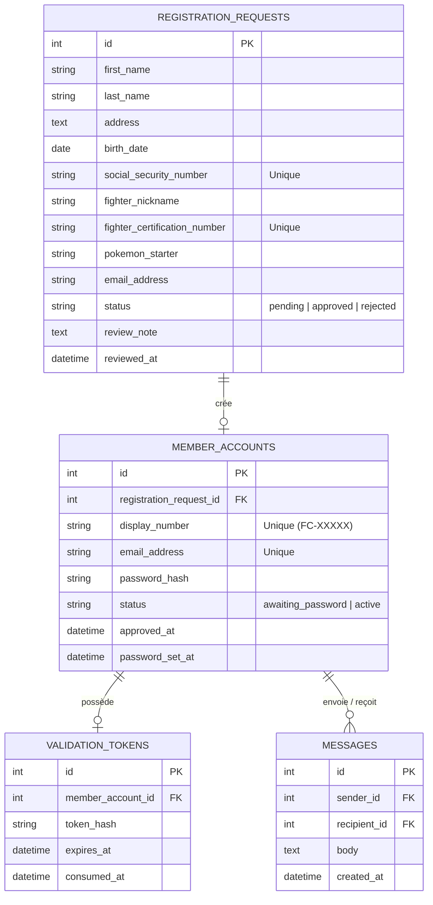
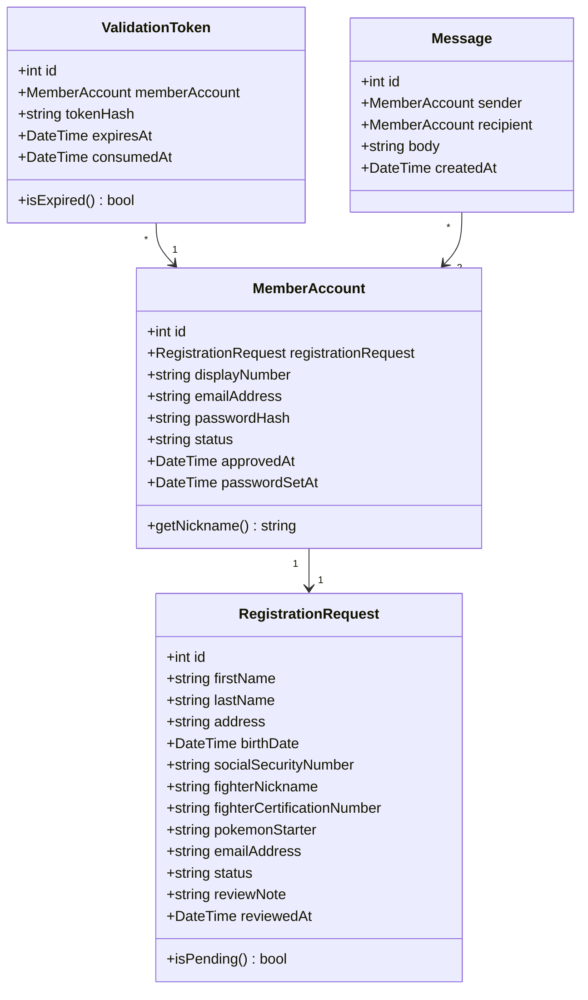
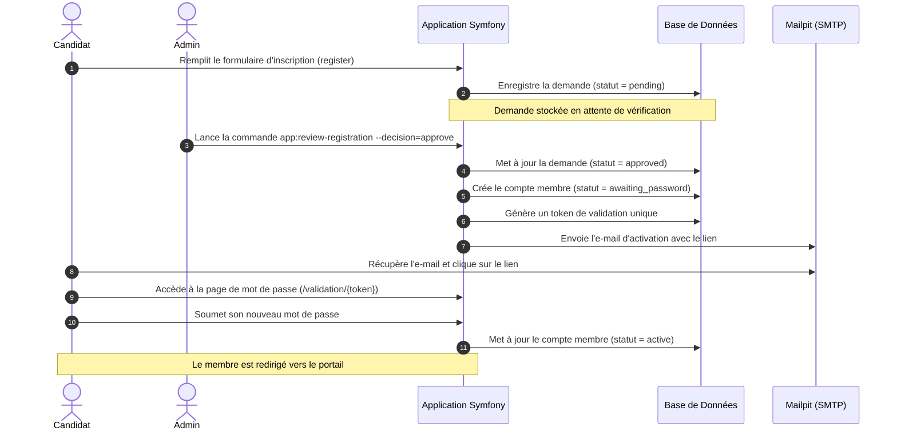
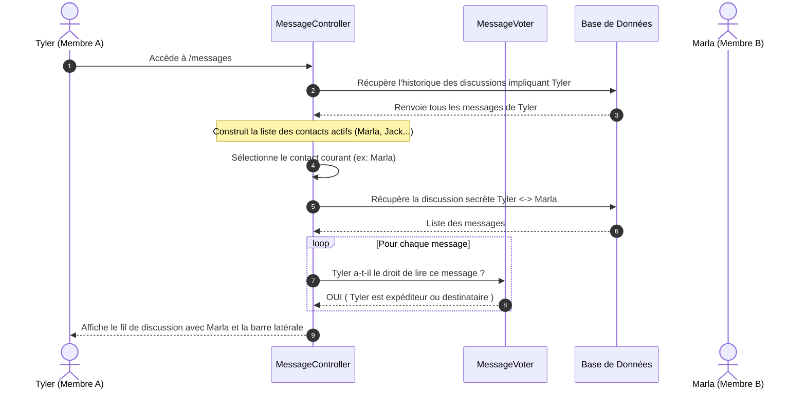

# Architecture et Conception Technique - FightClubPortal

Ce document décrit l'architecture globale, le schéma de base de données relationnel, les diagrammes de classes et les flux d'exécution du projet **FightClubPortal**.

---

## 🏗 Architecture Logicielle

Le projet est conçu comme un monolithe Symfony modulaire, structuré selon les principes SOLID :
* **Contrôleurs et Commandes** : Responsables de la gestion des requêtes HTTP (minces) et CLI.
* **Services Applicatifs** : Contiennent les règles métiers (ex: `RegistrationReviewService`, `ValidationEmailSender`).
* **Modèle de Données (Doctrine ORM)** : Entités riches avec contraintes de validation (`Assert\Regex`, `LessThanOrEqual`, etc.).
* **Composants UI (Twig/Bootstrap)** : Composants réutilisables pour le frontend.
* **Cadre de Sécurité** : Pare-feux Symfony (`security.yaml`), authentification basée sur la session, et contrôles d'accès par Voter (`MessageVoter`) et Subscriber (`PasswordSetupRequiredSubscriber`).

---

## 📊 Schéma Relationnel (Database)

Voici le schéma relationnel des tables SQL représenté en notation Mermaid ERD :

---

##  UML Class Diagram

Diagramme de classe des entités principales de l'application :

---

## 🔄 Flux d'Exécution et Séquences

### 1. Inscription et Validation d'un Nouveau Membre
Ce flux décrit les étapes depuis l'inscription d'un candidat jusqu'à l'activation complète de son compte :

### 2. Échange de Messages Sécurisés
Ce flux décrit la façon dont les messages sont séparés en discussions dans la messagerie chiffrée :

---

## 🔒 Audit de Sécurité et Prévention des Fuites de Données

Un audit de sécurité a été réalisé pour garantir la confidentialité des données sensibles (comme le numéro de sécurité sociale et le numéro d'accréditation CERFA-666) :

1. **Aucun Journal de Données Sensibles (Logs)** :
   * Les logs applicatifs (configurés via le framework standard de Symfony) ne contiennent aucune référence aux champs d'identité sensibles (`socialSecurityNumber`, `fighterCertificationNumber`, `address`, `birthDate`).
   * La configuration de base de données ORM (`doctrine.yaml`) désactive le traçage des paramètres de requêtes SQL (`profiling_collect_backtrace` uniquement si `kernel.debug` est actif, et totalement désactivé en production).
2. **Obfuscation des Messages d'Erreur (Unicité)** :
   * Pour éviter que des attaquants puissent deviner l'existence de comptes de combattants par force brute sur le numéro de sécurité sociale ou d'accréditation, les contraintes d'unicité renvoient un message générique et opaque :
     `"Une demande d'inscription existe déjà pour les informations fournies."`
3. **Sécurisation des URL et Protection des E-mails** :
   * Les adresses e-mail de tous les membres sont masquées dans les interfaces de discussion et remplacées par leurs pseudonymes (`fighterNickname`), protégeant ainsi l'identité des membres actifs dans le portail.
   * L'accès au portail et aux discussions chiffrées est strictement contrôlé par un Voter (`MessageVoter`) qui interdit à tout tiers d'intercepter des messages qui ne lui sont pas destinés.
   * Tout compte non activé (statut `awaiting_password`) est automatiquement intercepté par un abonné d'événements noyau (`PasswordSetupRequiredSubscriber`) et redirigé vers l'étape de configuration du mot de passe, bloquant tout accès anticipé au portail.

