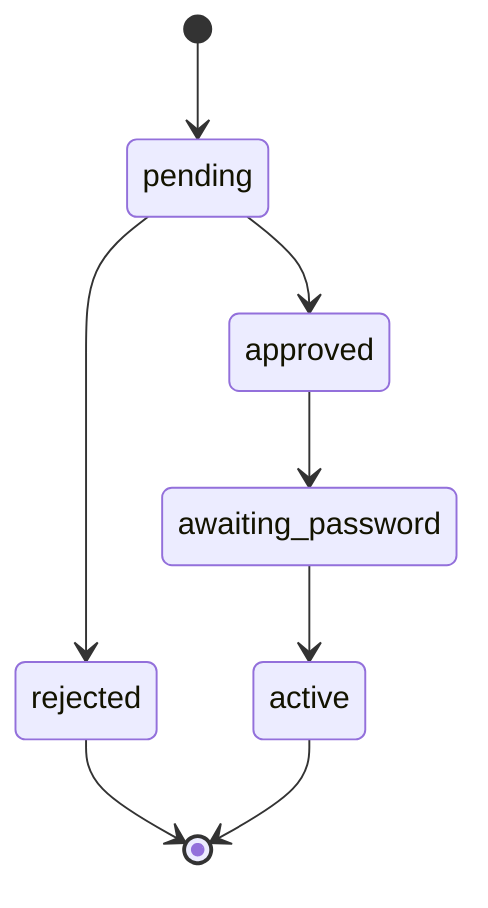

# Data Model - FightClubPortal

## RegistrationRequest

Represents a candidate's application before account activation.

### Fields

- `id`: internal identifier
- `firstName`: candidate first name
- `lastName`: candidate last name
- `address`: postal address
- `birthDate`: date of birth
- `socialSecurityNumber`: unique sensitive identifier
- `fighterNickname`: public fighter alias
- `fighterCertificationNumber`: CERFA 666 accreditation number
- `pokemonStarter`: selected pokemon starter , limited to three options allowed "Bulbasaur", "Charmander", or "Squirtle"
- `emailAddress`: contact email for the approval link
- `status`: `pending`, `approved`, or `rejected`
- `reviewedAt`: timestamp when the admin handled the request
- `reviewNote`: optional text explaining a rejection

### Rules

- Required fields cannot be blank.
- `socialSecurityNumber` must be unique.
- `fighterCertificationNumber` must be unique.
- `pokemonStarter` must be one of the tree allowed values.
- A request starts in `pending` and can only move to `approved` or `rejected`.

## MemberAccount

Represents an approved person who can enter the portal.

### Fields

- `id`: internal member identifier
- `registrationRequest`: one-to-one link to the originating request
- `displayNumber`: human-readable internal identifier
- `emailAddress`: login email
- `passwordHash`: encoded password
- `status`: `awaiting_password`, `active`, or `blocked`
- `approvedAt`: timestamp when approval was confirmed
- `passwordSetAt`: timestamp when the password was created

### Rules

- A member account is created only after approval.
- The account remains `awaiting_password` until the password is set.
- The account becomes `active` only after successful password creation.
- A blocked or rejected account cannot access the portal.

## ValidationToken

Represents the email link used to move a member into password creation.

### Fields

- `id`: internal identifier
- `memberAccount`: owning member account
- `tokenHash`: stored hash of the raw token
- `expiresAt`: expiration timestamp
- `consumedAt`: timestamp when the token was used

### Rules

- Tokens are single-use.
- Expired tokens must be refused.
- A token cannot be reused after the password is set.

## Message

Represents a private message between two active members.

### Fields

- `id`: internal identifier
- `sender`: sending member account
- `recipient`: receiving member account
- `body`: message content
- `createdAt`: send timestamp

### Rules

- Only active members can send or receive messages.
- A message is visible only to the sender and recipient.
- Non-authenticated users cannot access message content.

## State Transitions

## Relationships

- One registration request can become one member account.
- One member account can own many validation tokens over time, but only one valid token should exist at a time.
- One active member can send many messages and receive many messages.